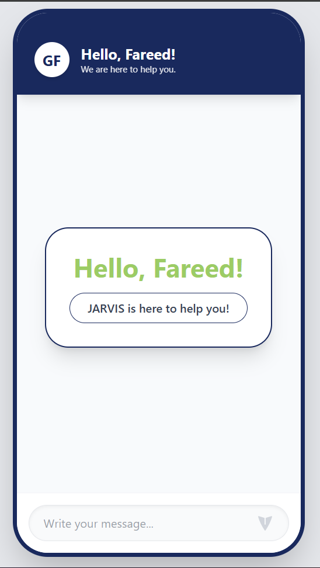
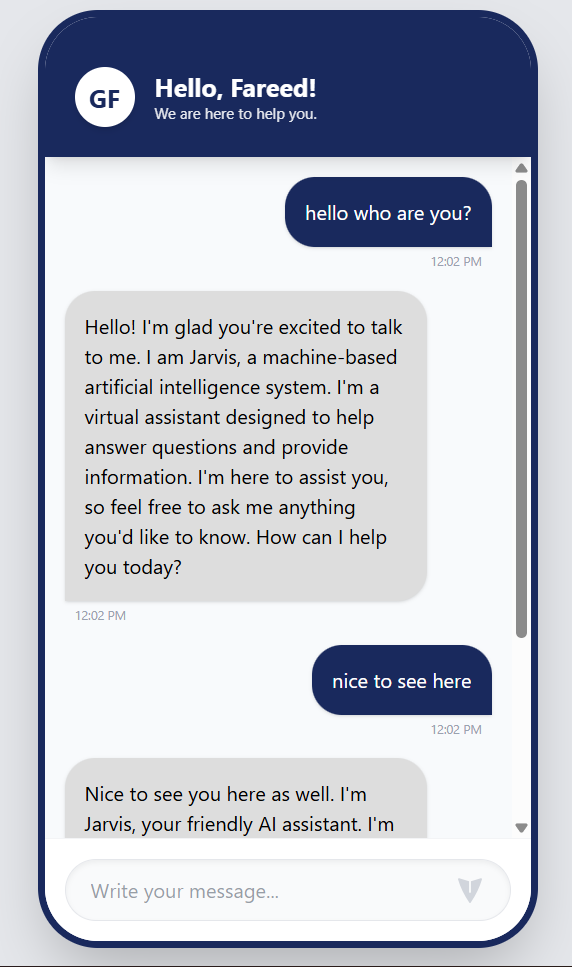

### 2. Frontend README Template
**(File Location: `chatbot-UI/README.md`)**

```markdown
# 📱 OZ Chatbot Frontend - React UI

A sleek, mobile-responsive chat interface inspired by the **Zong (OZ)** ecosystem. Built with **React** and **Tailwind CSS**.

## ✨ Features
* **Modern UI**: Polished, mobile-first design with a clean user experience.
* **Dynamic Welcome Screen**: Interactive "Hello, Ghulam!" start screen that transitions into chat.
* **Smart Bubbles**: Color-coded chat bubbles (#19295D for User, #DDDDDD for Bot).
* **Real-time API Integration**: Uses Axios to communicate with the FastAPI backend.

## 🎨 UI Colors
* **Primary (Navy)**: `#19295D`
* **User Bubble (Navy)**: `#19295D`
* **Bot Bubble (Light Grey)**: `#DDDDDD`

## 🚀 Quick Start

1. **Navigate to Folder**:
   ```bash
   cd chatbot-UI


Install Packages:
npm install


Configure Backend URL: Ensure App.jsx points to http://localhost:8000/chat.

Launch App:
npm run dev

📸 Screenshots
Welcome Screen


Interactive Chat Interface
